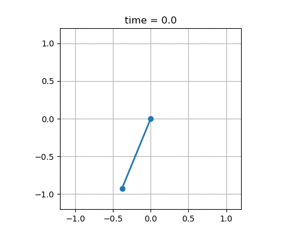

# HW2

## What to do

Your goal is to implement the DQN (Deep Q Network) reinforcement learning algorithm. The key difference between DQN and Q-learning (which you implemented in [HW1](../hw1)) is that DQN uses a neural network to approximate the function Q rather than using a table of numbers. One consequence is that DQN can be applied to systems with a *continuous* state space, while Q-learning applied only to systems with a *finite* state space. Note, however, that DQN still requires a finite action space.

DQN is described in the following paper:

> V. Mnih, K. Kavukcuoglu, D. Silver, A. A. Rusu, J. Veness, M. G. Bellemare, A. Graves, M. Riedmiller, A. K. Fidjeland, G. Ostrovski, S. Petersen, C. Beattie, A. Sadik, I. Antonoglou, H. King, D. Kumaran, D. Wierstra, S. Legg, and D. Hassabis (2015) "Human-level control through deep reinforcement learning", Nature 518, 529–533. DOI: [10.1038/nature14236](https://dx.doi.org/10.1038/nature14236).

You can download this paper freely [at its DOI](https://dx.doi.org/10.1038/nature14236) from any computer on the campus network. You can also download this paper through the [university library website](https://library.illinois.edu).

In particular, you will find a derivation of DQN, pseudocode, and details of implementation in the "Methods" section of Mnih et al (2015). You will also find a list of hyperparameter values that were used by the authors in "Extended Data Table 1." You may find that certain details are either missing or need to be changed, so should expect that it may take you some time to figure out exactly what to implement.

We have provided one environment with which to test your algorithm:

* A simple pendulum with a *continuous* state space and with a discretized action space (e.g., http://underactuated.mit.edu/pend.html) - see [simulation code](discreteaction_pendulum.py) and [example of how to use simulation code](test_discreteaction_pendulum.py)

Note that we have enabled recording movies of the pendulum this time (see the [example code]((test_discreteaction_pendulum.py))):

Please express the reinforcement learning problem as a Markov Decision Process with an infinite time horizon and a discount factor of `gamma = 0.95`.

Please use a neural network with **two** hidden layers that each have 64 units. Please use a `tanh` activation function at both the hidden layers, with a linear activation function at the output layer. (You are of course free to play around with the network architecture, just make sure you present results for this one at least.)

## What to submit (due by 10am on Tuesday, October 6)

Create a branch of our `598rl_fa20` github repository. Call this branch `hw2_yournetid`, with "`yournetid`" replaced by your own NetID in **lower-case letters**. In this branch, create the directory `./hw2/hw2_yournetid` in our github repository. This directory should contain all of your code (including a copy of `discreteaction_pendulum.py`). It should also contain a file called `README.md` with your results and with instructions for how to run your code to recreate your results.

At minimum, the `README.md` should contain the following results for at least one trained agent:
* One plot that contains learning curves (the total discounted reward versus the number of simulation steps)
* One plot with an example trajectory
* One animated gif with an example trajectory
* A visualization of the policy
* A visualization of the value function

At minimum, the `README.md` should also contain the results of an ablation study, similar to what appears in "Extended Data Table 3" of Mnih et al (2015). In particular, you should compare the performance of DQN under the following conditions:
* With replay, with target Q (i.e., the standard algorithm)
* With replay, without target Q (i.e., the target network is reset after each step)
* Without replay, with target Q (i.e., the size of the replay memory buffer is equal to the size of each minibatch)
* Without replay, without target Q (i.e., the target network is reset after each step **and** the size of the replay memory buffer is equal to the size of each minibatch)

Your results are likely to vary from one training run to the next. You will be able to draw stronger conclusions from your ablation study if you average your results over several training runs. Please discuss (briefly) both the design of your ablation study and your conclusions.

Remember that we expect each of you to write your own code from scratch.

Final submission should be by pull request.

## Code review (due by 10am on Tuesday, October 13)

You are responsible for reviewing the code of at least one colleague. In particular, you should:
* Choose a [pull request](https://github.com/compdyn/598rl-fa20/pulls) that does not already have a reviewer, and assign yourself as a reviewer. **Do this no later than Tuesday, October 6.**
* Perform a review. **Do this no later than Friday, October 9.**
* Improve your own code based on reviews that you receive. Respond to every comment. If you address a comment fully (e.g., by changing your code), you mark it as resolved. If you disagree with or remain uncertain about a comment, engage in follow-up discussion with the reviewer on github. (Reply to this follow-up on code you reviewed as well!) **Do this no later than 10am on Tuesday, October 13.**

The goal of this review process is to arrive at a version of your code that is functional, reasonably efficient, and easy for others to understand. The goal is *not* to make all of our code the same (there are many different ways of doing things). The goal is also *not* to grade the work of your colleagues - your reviews will have no impact on others' grades.

In your reviews, don't forget to remind your colleagues to do the simple things like name their PR correctly ("Submit hw2 for Firstname Lastname (netid)") and include their name in their README!

Here are some resources that may be helpful:
* [Github docs on PR code reviews](https://docs.github.com/en/github/collaborating-with-issues-and-pull-requests/about-pull-request-reviews)
* [Google best practices for code review](https://google.github.io/eng-practices/review/)
* From Microsoft, a [blog post on code review](https://devblogs.microsoft.com/appcenter/how-the-visual-studio-mobile-center-team-does-code-review/) and a [study of the review process](https://www.microsoft.com/en-us/research/wp-content/uploads/2016/05/MS-Code-Review-Tech-Report-MSR-TR-2016-27.pdf)
* From RedHat, a [python-specific blog post on code review](https://access.redhat.com/blogs/766093/posts/2802001)
* [The Art of Readable Code (Boswell and Foucher, O'Reilly, 2012)](https://mcusoft.files.wordpress.com/2015/04/the-art-of-readable-code.pdf), a modern classic

Please let us know if you have a favorite resource that you think should be added to this list.
