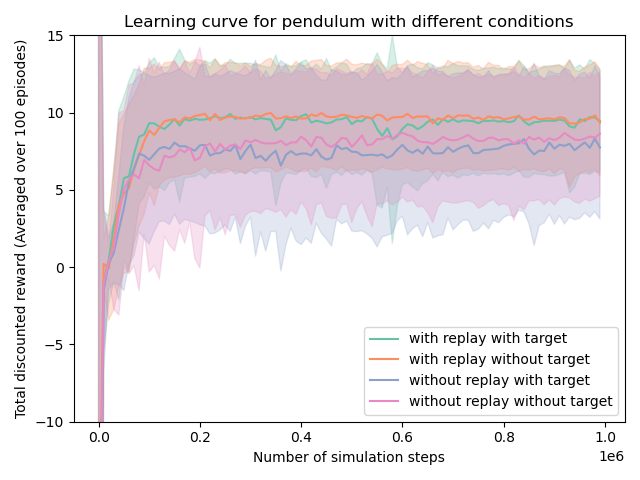
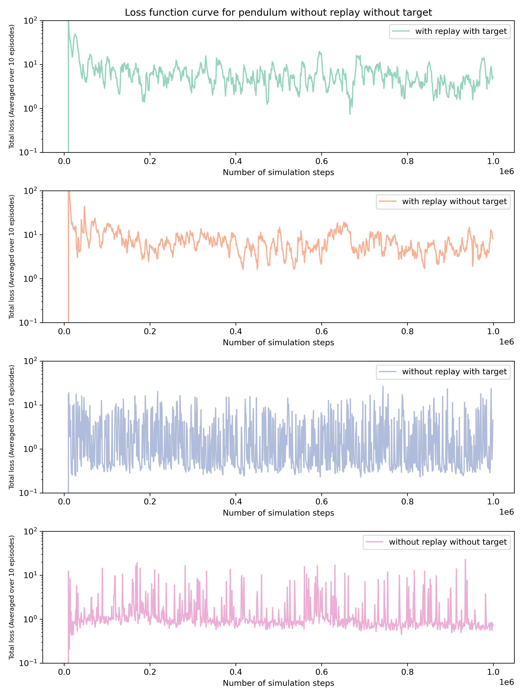
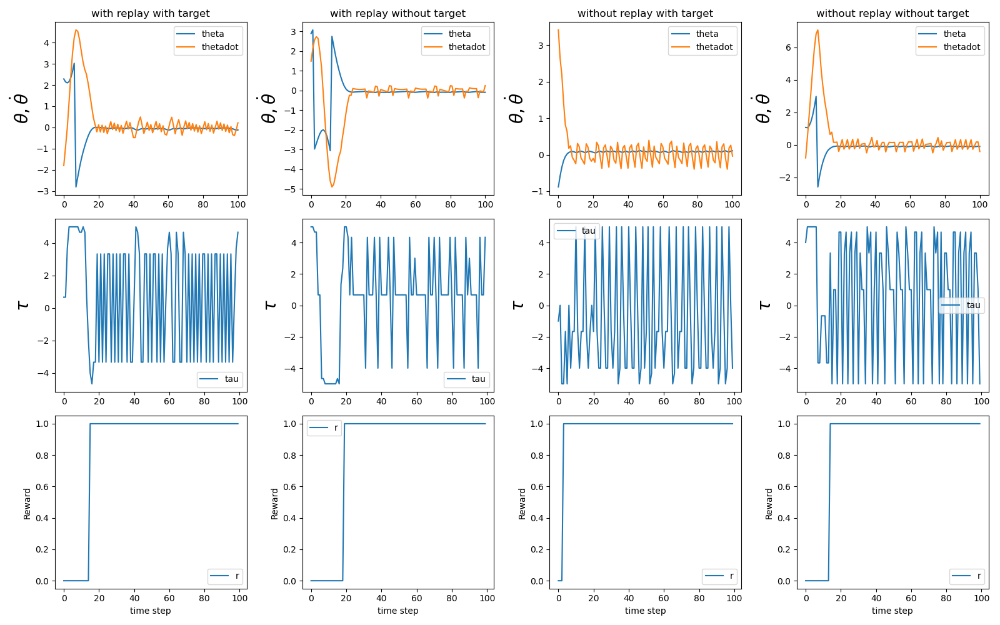
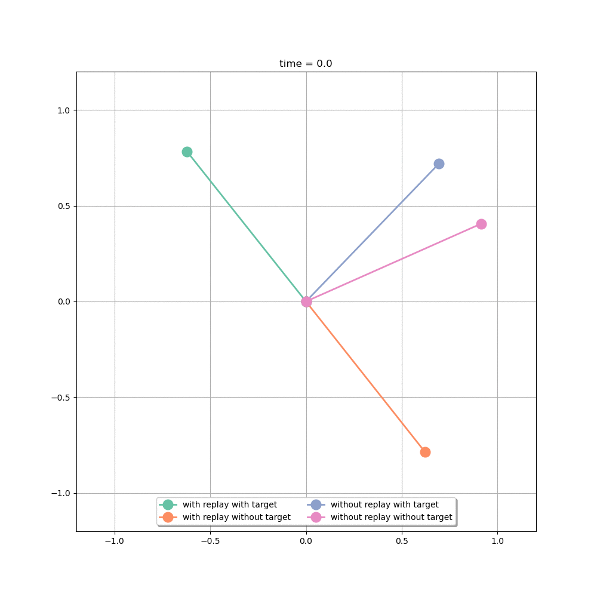
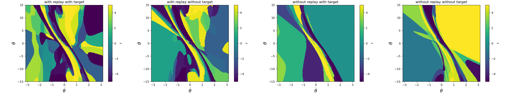
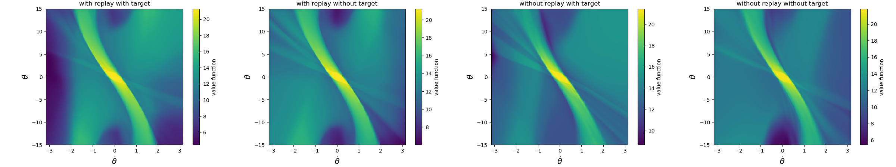

# HW2 (Fan Kiat Chan, fchan5)

## How to run the code
The Q network training is implemented in [`train_pendulum.py`](train_pendulum.py). Training with different conditions for an ablation study is conducted by running [`train_pendulum.py`](train_pendulum.py) with different arguments. An additional script [`train_them_pendulums.py`](train_them_pendulums.py) is written to run the script with different conditions in parallel. Once all the training is done, the Q networks as well as the learning curve data can be found in save directory passed as an argument `--save_dir` when calling [`train_pendulum.py`](train_pendulum.py). The generated results are loaded for plotting various analytics through [`run_pendulum.py`](run_pendulum.py), where the results for the ablation studies are put together for comparison.

To recreate the data generated for this assignment, one can first run [`train_them_pendulums.py`](train_them_pendulums.py) followed by [`run_pendulum.py`](run_pendulum.py).

## Training parameters
The training is done for 1,000,000 simulation steps (`num_train_episodes = 10,000` episodes) and the learning curve is obtained by averaging over `num_training_runs = 10` independent training runs. Below we list a few important training parameters used for training DQN **with replay and with target Q**.

| Hyperparameter | Value | Description                                                            |
| ------ | ----- | ---------------------------------------------------------------------- |
| `gamma`      | 0.95  | Discount factor                                                        |
| `epsilon`     | 0.1     | Exploration rate for epsilon-greedy                                               |
| `replay_memory_buffer_size`      | 10,000   | Max replay memory buffer size                                                 |
| `NUM_INITIAL_EXPLORE`     | 10,000    | Initial exploratory simulation steps by random policy before network training starts                |
| `mini_batch_size`      | 25    | Minibatch buffer size |
| `target_reset_frequency`      | 1000   | Target network update frequency. Setting this to 1 translates to reseting target network after every simulation step          |
| `alpha`      | 0.00025 | Learning rate                                                          |

Subsequent cases of training with or without replay and target Q adopt the same parameters as above except with a few minor changes.
* With replay, without target Q (target reset frequency = 1)
* Without replay, with target Q (replay memory buffer size = 25)
* Without replay, without target Q (replay memory buffer size = 25, target reset frequency = 1)

## Pendulum results
### 1. Learning curves and loss functions for different training conditions
* Total discounted reward is higher when training is done with replay (green and orange curves).
* For both the training done with replay (green and orange curves), it seems that with target Q the training converges to its steady total discounted reward slightly faster than training without target Q. Similarly, this is also observed when comparing the learning curves from training without replay (blue and pink curves).

From the loss function we observe that while they are generally lower without replay, the variations are larger as compared to training with replay.

### 2. Trajectories for different training conditions
We observe that for the different training conditions, all the trained agents are able to achieve the task of maintaining the pendulum upright. 

### 3. Animation of trajectory for different training conditions
The animation below shows the trajectory of the pendulum under different trained agents. Again, we see that all the trained agents are able to achieve the task. One small modification was done in the `discreteaction_pendulum.py` in order to obtain a better illustration in the animation, where we set `max_theta_for_upright = 0.05 * np.pi`. One can go further and reduce the upright condition, but this would most likely require more intensive training (i.e. more episodes) as well as perhaps a denser neural network to capture the precise control policy for the pendulum.

### 4. Visualization of policy
In the plots below, the color contours shows the the torque (action) at different states under the policy from different trained agents. They all look very similar, which is consistent with their ability to maintain the pendulum upright as illustrated in the animated trajectories.

### 5. Visualization of value function
Below are the value function learned learned by different agents. We note the brighter spot in the middle of the contour (namely higher value function) corresponds to where we would expect the agent would aim to be, at small angles and angular velocity, which effectively translating physically to maintaining "upright".

