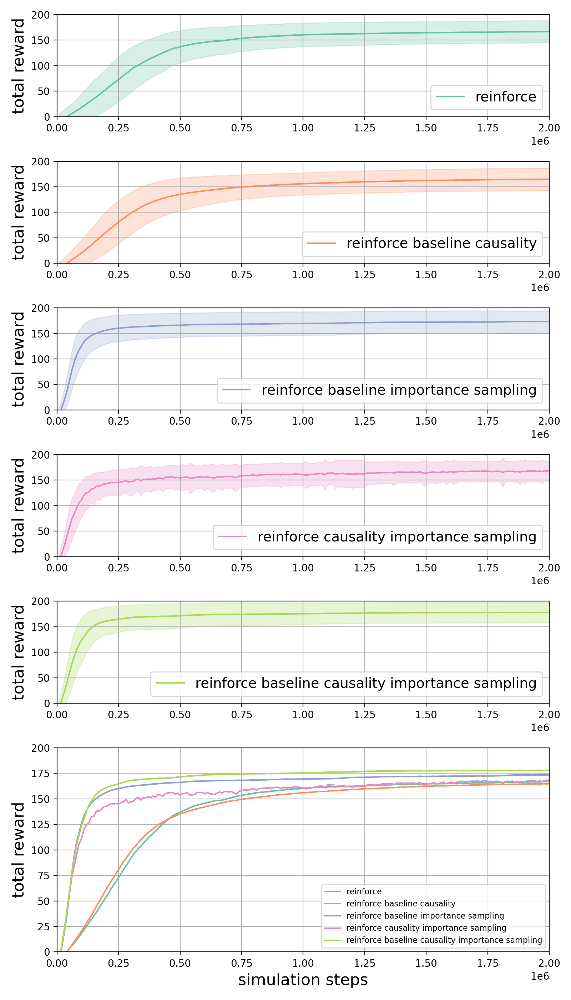
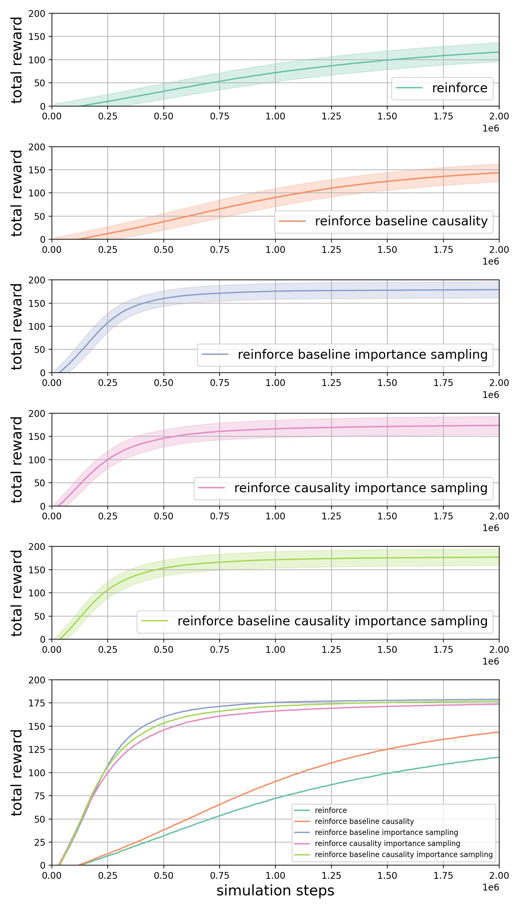
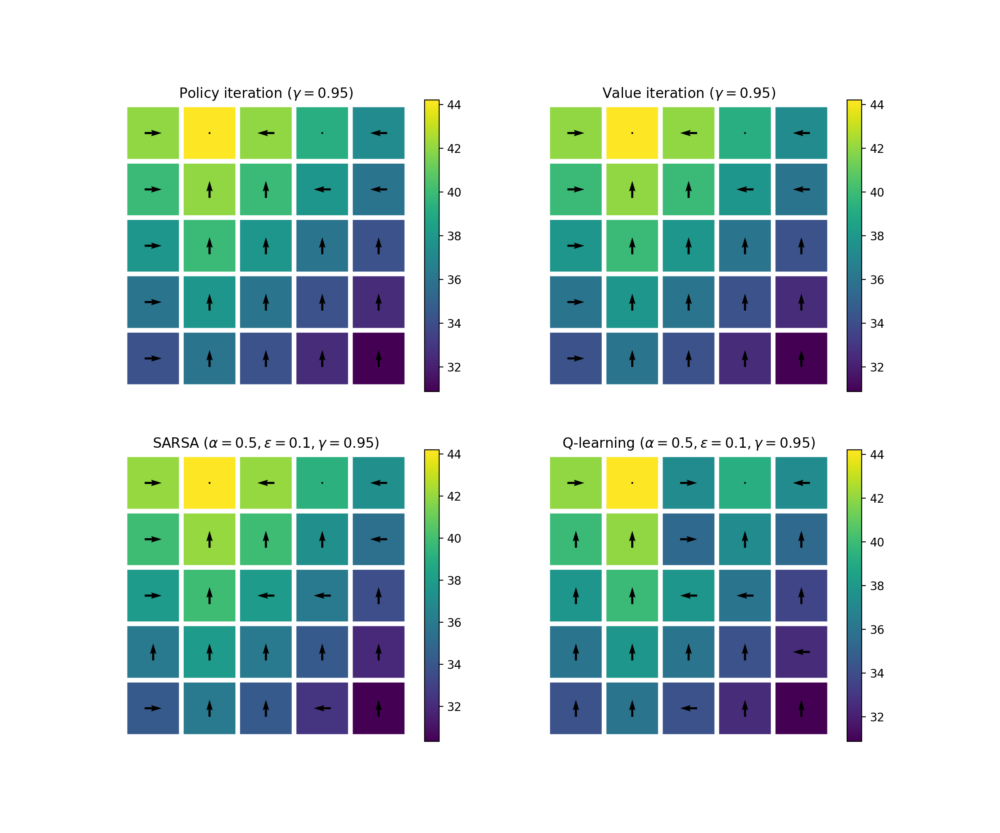
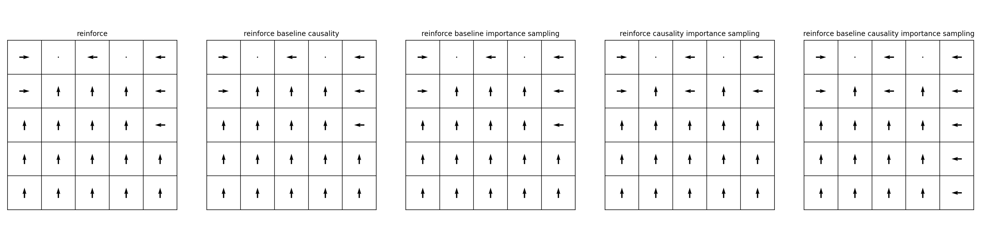
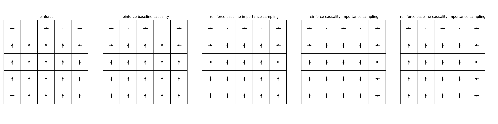
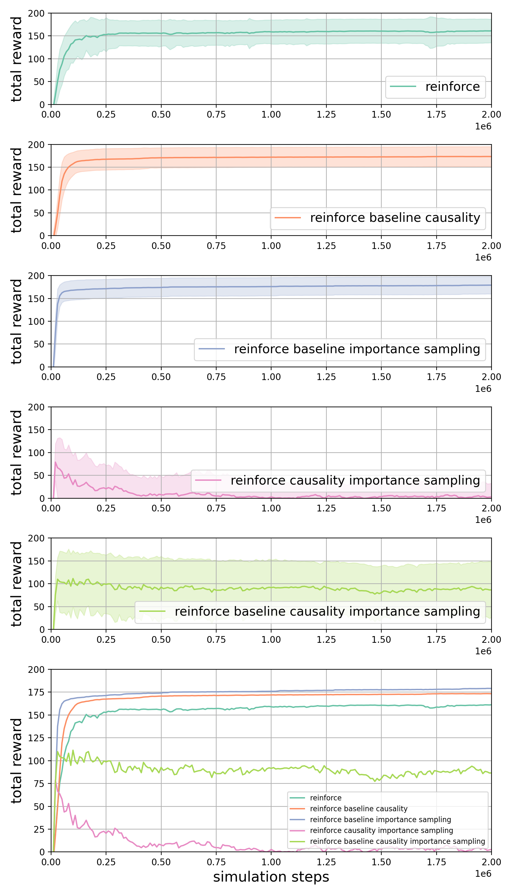
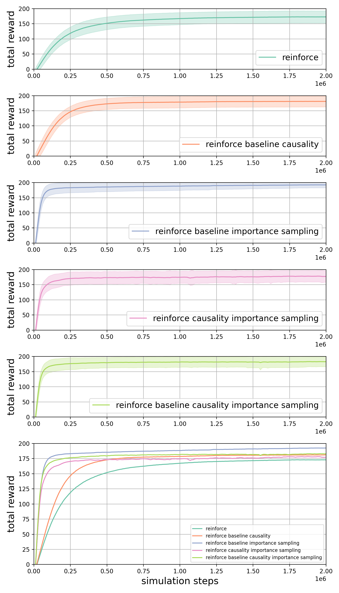
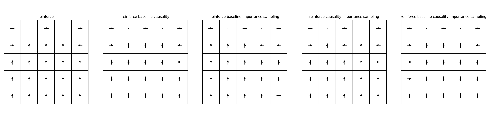

# HW1 (Fan Kiat Chan, fchan5)

# How to run the code for the ablation study
The REINFORCE algorithm is implemented in [`train_PG_gridworld.py`](train_PG_gridworld.py). Running the script without any arguments would result in training the agent in the gridworld with REINFORCE without any extensions. The different extensions can be turned on by passing the argument `--baseline True`, `--causality True` or `--importance_sampling True`. An additional script [`train_PG_diff_extensions.py`](train_PG_diff_extensions.py) is written to call [`train_PG_gridworld.py`](train_PG_gridworld.py) with different combinations of these extensions for an ablation study. Once all training is done, the learning curves and policy can be found in the save directory passed as an argument `--save_dir` when calling [`train_PG_gridworld.py`](train_PG_gridworld.py). The generated results are loaded for plotting through [`run_PG_gridworld.py`](run_PG_gridworld.py), where the results for the ablation studies are put together for comparison.

To recreate the data generated for this assignment, one can first run [`train_PG_diff_extensions.py`](train_PG_diff_extensions.py) followed by [`run_PG_gridworld.py`](run_PG_gridworld.py).

# Training parameters
The training is done for 2,000,000 simulations steps (`num_training_episodes = 200` with 100 steps per episode and `batch_size = 100` for trajectory sampling). The learning curve is obtained by averaging over `num_training_runs = 100` independent training runs. Learning rate used for [SGD](https://pytorch.org/docs/stable/optim.html#torch.optim.SGD)/[Adam](https://pytorch.org/docs/stable/optim.html#torch.optim.Adam) optimizer is `alpha = 0.01`. When importance sampling is used, the off-policy training takes 5 steps using the computed gradient.

# Gridworld results
## Comparison of REINFORCE with and without extensions
In the following, we conduct an ablation study for REINFORCE with and without different extensions and compare the results using [SGD optimizer](https://pytorch.org/docs/stable/optim.html#torch.optim.SGD) and [Adam optimizer](https://pytorch.org/docs/stable/optim.html#torch.optim.Adam). We use a trajectory `batch_size = 100` and learning rate `alpha = 0.01`, ran for 200 epochs, resulting in a total of 2,000,000 simulation steps.

### Learning curves
We see from the learning curve that learning improves when extensions are included. Importance sampling which allows for off-policy learning provides a speedup in convergence. We also observe that baseline shift is better at variance reduction when compared to causality, as can be seen from the 'noisier' standard deviation band when causality is used with importance sampling. The last subplot in the figures shows the comparison of the total reward using different versions of the REINFORCE algorithm.

| Stochastic gradient descent optimizer                    | Adam optimizer                                            |
| -------------------------------------------------------- | --------------------------------------------------------- |
|  |  |

### Visualization of the policy
Below we show the visualizations of the different (greedy) policy obtained using different versions of REINFORCE and different optimizer in comparison with the policies obtained from SARSA and Q-learning and optimal policies obtained using value and policy iteration from HW1 .

##### Optimal policies obtained using value and policy iteration and policies obtained using SARSA and Q-learning (from HW1)
The color contour represents the state-value functions.

##### Stochastic gradient descent optimizer

##### Adam optimizer

## Comparison between different optimizer
Comparing the learning curves of different optimizers above, we notice that Adam optimizer learns slightly slower than SGD. However, we notice that one can increase the learning rate by setting a higher `alpha`. When increasing the learning rate 10 times to `alpha = 0.1`, we notice that Adam optimizer do indeed show learning rate improvement, while SGD optimizer show signs of instability as exemplified by the larger standard deviation bands.

| Stochastic gradient descent optimizer                    | Adam optimizer                                            |
| -------------------------------------------------------- | --------------------------------------------------------- |
|   |   |

Besides improvement in learning rate, we also notice that Adam optimizer manages to get out of the local minima (at total reward ~160-170) while SGD optimizer either is still stuck at the local minima or becomes unstable entirely. This can be further demonstrated when visualizing the greedy policy of the learned agent as below.

##### Stochastic gradient descent optimizer

##### Adam optimizer

For example if we look at the case when we use baseline shift and importance sampling (middle visualization), we notice that for SGD, the fourth column in the grid world shows that the policy is stuck in the loop with lower reward, while for Adam optimizer, the agent escapes the local minima and move towards the loop with the higher reward (second column).

A few things we found from this are:
- SGD seems converges more quickly to a solution when using low learning rates, but is more likely to be trapped in a local minima when compared to Adam.
- Adam seems to be able to handle larger learning rate `alpha` as compared to SGD

## Comparison of sample variance of the policy gradient with and without extensions
A separate script [`PG_compare_variance_mean.py`](PG_compare_variance_mean.py) is written to investigate the effect of different extensions to the sample variance of the policy gradient. The batch used is generated by running 5000 episodes of the gridworld averaged over 10 independent runs. The relative change to standard deviations and mean of the policy gradient with respect to REINFORCE without any extensions are as follows:

- std dev relative change with baseline: -48.85 %
- std dev relative change with causality : -33.85 %
- std dev relative change with importance sampling : 0.82 %
- mean relative change with baseline : 4.18 %
- mean relative change with causality : 3.12 %
- mean relative change with importance sampling : 98.97 %

Here the standard deviation relative change is computed as the relative change of the sum of all the standard deviation for all state-action pairs. For the mean, we compute the L2-norm relative change compared to REINFORCE without any extensions.

We see that causality and baseline shift do indeed reduce sample variance, with baseline shift being the more effective method for variance reduction. Sample variance is mostly un changed when using importance sampling. While baseline shift and causality reduces sample variance, it also maintains the mean around the same, whereas importance sampling causes the mean to change quite a lot.
