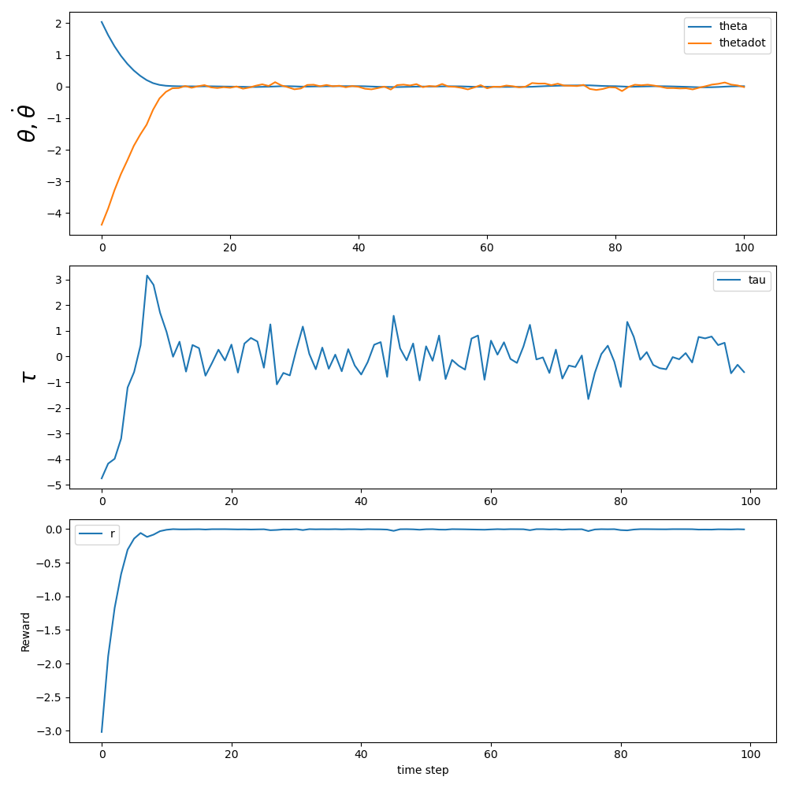

# HW4 (Fan Kiat Chan, fchan5)

## How to run the code
The PPO algorithm is implemented in ['train_PPO.py'](train_PPO.py). Running the script without any arguments would result in training the agent in the ['pendulum.py'](pendulum.py) environment with default hyperparameters. An additional script ['train_parallel_PPO.py'](train_parallel_PPO.py) is written to call ['train_PPO.py'](train_PPO.py) in parallel. Once all training is done, the learning curves and policy can be found in the save directory passed as an argument `--save_dir` when calling ['train_PPO.py'](train_PPO.py). The generated results are loaded for plotting through ['run_pendulum.py'](run_pendulum.py), where the results for the training are plotted and visualized.

To recreate the data generated for this assignment, one can first run ['train_parallel_PPO.py'](train_parallel_PPO.py) followed by ['run_pendulum.py'](run_pendulum.py).

## Pendulum with dense reward
### Training parameters
The training for pendulum with dense reward are done for `num_iter=750` iterations, each iteration done using a batch of `num_ep_per_iter=20` episodes with a maximum of 100 simulation step per episode, resulting in a total of 1,500,000 simulations steps. For actor and critic optimization, the training is done for 20 epochs, each with `mini_batch_size=1000` samples (simulation steps). Other hyperparameter include ([Adam](https://pytorch.org/docs/stable/optim.html#torch.optim.Adam)) optimizer learning rate `alpha=0.001`, clipping factor `epsilon=0.2`.

### Actor and critic learning curve
Below are the learning curves for the trained actor (reward curve) and critic (MSE loss). From the actor learning curve, we see that the agent starts to approach a decent policy around 400,000 simulation steps, and achieves a good policy at 800,000 simulation steps (as shown by the animation and trajectory curves). From the critic learning curve, we see that the MSE loss also approaches zero around 400,000 simulation steps, consistent with the actor learning curve.

### Example trajectory
We see that the agent is able to quickly bring the pendulum to the upright position and maintain the pendulum at that inverted position as well as at low angular velocity.

### Animation
We see that the agent quickly swings the pendulum across a larger distance to bring it to the inverted position, taking advantage of the momentum (since the reward is a dense reward, the agent learns to achieve the task while minimizing energy used).

### Policy visualization
In the plots below, the color contours shows the the torque (action) in the state space under the obtained policy.

### Value function visualization
Below are the value function learned learned by the agent. We note the brighter spot in the middle of the contour (namely higher value function) corresponds to where we would expect the agent would aim to be, at small angles and angular velocity, which effectively translating physically to maintaining "upright".

