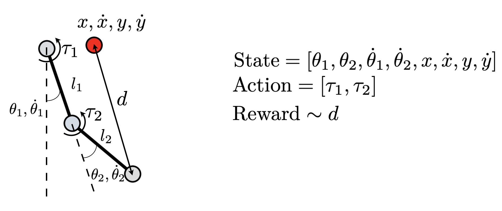
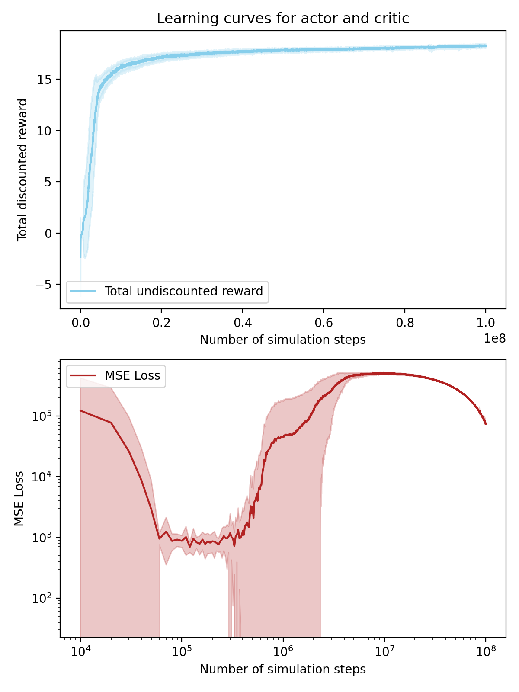
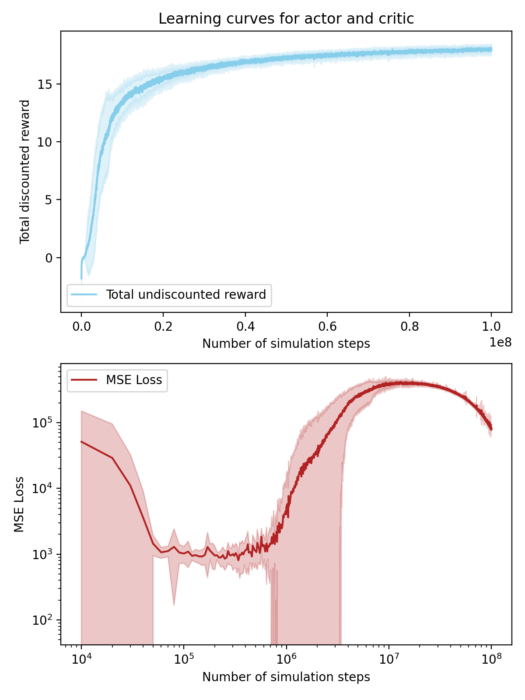
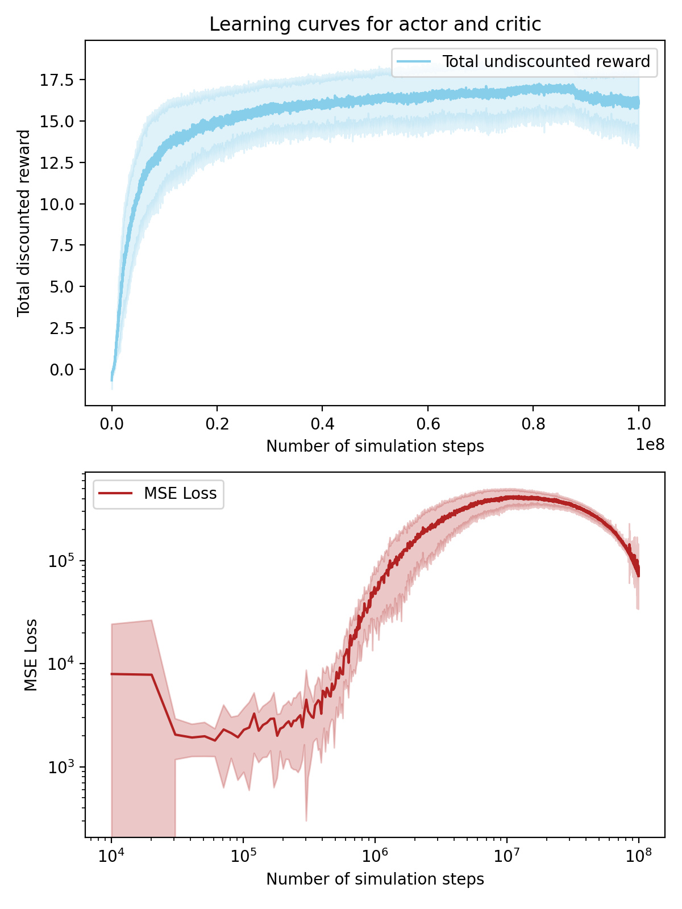
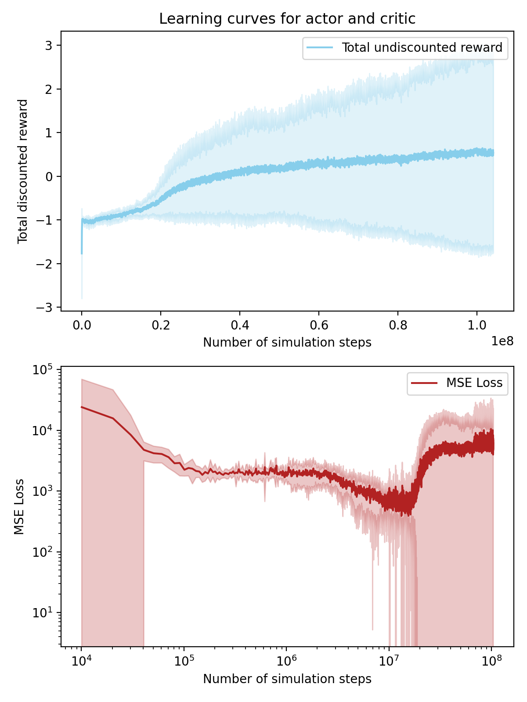
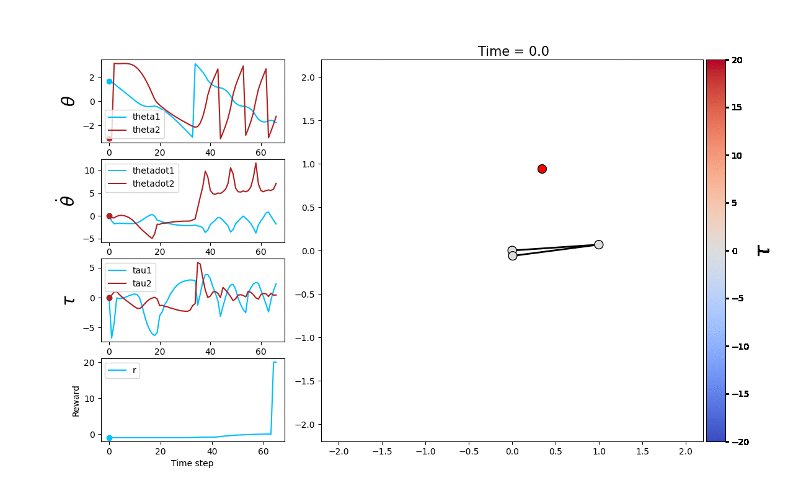

# HW5 (Fan Kiat Chan, fchan5)

## Overview
An [acrobot](http://underactuated.mit.edu/acrobot.html) is a planar two-link arm that is controlled by torque inputs at the joint. In this project, we explore the behavior of the acrobot to achieve different tasks under the zero gravity assumption. Below are the different tasks trained using PPO algorithm:
* Reaching for a fixed target
* Reaching for a randomly moving target
* Reaching for a target that is acted upon by a force
* Collecting (towards the origin) a target that is acted upon by a force

Additionally, instead of only applying torque inputs at the joint as described in [http://underactuated.mit.edu/acrobot.html](http://underactuated.mit.edu/acrobot.html), we also apply a torque at the fixed end. The system implemented here and the state-action-reward setup are described in the figure below. The reward `r` for different task are as below:
* Reaching for a target under different conditions : `r = - d * d + bonus`
* Collecting target towards origin : `r = x * x + y * y + bonus`
where `bonus = 20` is given to the agent when it is within some small distance away from the goal

## How to run the code
The parallel PPO algorithm is implemented in [train_PPO_MPI.py](train_PPO_MPI.py). Running the script without any arguments would train the agent in the [acrobot_with_target.py](acrobot_with_target.py) environment with default hyperparameters. The script is executed using MPI by running `mpiexec -n X train_PPO_MPI.py --arguments Y` command, where `X` is the number of processes for MPI and `Y` is the different arguments that sets the training hyperparameters. Below are the options for argument inputs in which the default values are used for training the agent throughout the project:

| Argument                | Default          | Description                                                                   |
| ----------------------- | ---------------- | ----------------------------------------------------------------------------- |
| `save_dir`              | test\_MPI\_save  | Save directory for agent training                                             |
| `mini_batch_size`       | 8000             | Mini batch from sample buffer for taking iteration steps                      |
| `alpha`                 | 0.0001           | Learning rate for actor and critic                                            |
| `epsilon`               | 0.2              | Epsilon for clipping of surrogate objective in PPO algorithm                  |
| `num_iters`             | 10000             | Number of iteration for training                                              |
| `num_eps_per_iter`      | 100              | Number of episode per iteration (buffer of episode)                           |
| `max_num_steps_per_ep`  | 100              | Maximum number of simulattion steps per episode                               |
| `actor_epochs_per_iter` | 20               | Number of epochs for actor training per iteration                             |
| `critic_epochs_per_iter`| 20               | Number of epochs for critic training per iteration                            |
| `task`                  | reach            | Task for acrobot, either to `reach` or `collect` target                       |
| `target_behavior`       | fixed            | Behavior for target motion, either `fixed`, `random`, `forcing`               |
| `run_id`                | -1               | Setting run id for each training run. Used for multiple runs to average over. |
| `dump_frequency`        | 1                | Frequency for saving snapshot of the training                                 |
| `restart`               | False            | Set to true for restarting training from last snapshot.                       |

Once all training is done, the learning curve data, trained actor and critic can be found in the save directory passed as an argument `--save_dir` when calling [train_PPO.py](train_PPO.py). The generated results are loaded for plotting through [run_acrobot.py](run_acrobot.py), where the results for the training are plotted and visualized.

## Results
Below we show the training curves and the resulting performance of the agent trained for different tasks. The training curves are averaged over 10 independent runs.

### Task 1: Reaching for a fixed target
The learning curve for the actor shows low variance between different runs. However, the loss for the critic seems to decrease initially, but increase suddenly before starting to decrease again. The odd behavior of loss curves for the critic is likely due to the `bonus` given in the reward, which introduces a spike in the state space value function and affects the critic learning. Nonetheless, the agent seems to be able to perform the task amazingly well as shown in the animation below.

### Task 2: Reaching for a randomly moving target
Actor learning curve starts to show slightly more variance, which makes sense given that the target now behaves randomly. The loss curves for the critic again shows the same behavior as before. The agent still performs fairly well at tracking and following the moving target.

### Task 3: Reaching for a target that is acted upon by a force
In this case, the force is prescribed between the tip of the acrobot and the target. The force is described as `force = -vel_relative / np.exp(L * 5 * distance**2) - 6.0 * np.pi * target_radius * nu * target_vel`, where `vel_relative`, `L`, `distance`, `target_radius = 0.1`, `nu = 0.1`, `target_vel` are the relative velocity between the acrobot tip and target, total length of acrobot, distance between target position and goal (i.e. acrobot tip or origin), target radius, dampening coefficient for target motion, and target velocity. The performance of the agent is rather interesting. It takes a slight penalty of approaching the target at high velocity (which causes a larger force and the target to move with a larger velocity away from the origin), and quickly switches to tracking the moving target to stay near the target. This can be seen in the animation shown below. Interestingly, it seems like the target combines the behavior from task 1 and task 2, even though the trainings are done from scratch among these different tasks.

### Task 4: Collecting a target that is acted upon by a force
Finally, we challenge the algorithm to train an agent under the environment with force between acrobot tip and target to collect the target towards the origin (i.e. fixed end of the acrobot). The episode is terminated when the target is within some small radius of the origin. Interestingly but unsurprisingly, the actor learning curve shows a larger variance between different independent training runs which increases with simulation step, indicating the agent might be stuck in a local minima between different runs. This makes sense since the task at hand is more complex than the ones before. Instead of reaching for a target, it now has to direct a target to a certain position via non-linear interactions introduced by the fictitious force. Picking a decently trained agent shows decent performance in achieving the task, where the agent spins around to hit the target towards the origin in multiple stages, slowly hitting the target towards the origin, almost as if it is playing a game of golf, where it achieves the task in multiple steps.

